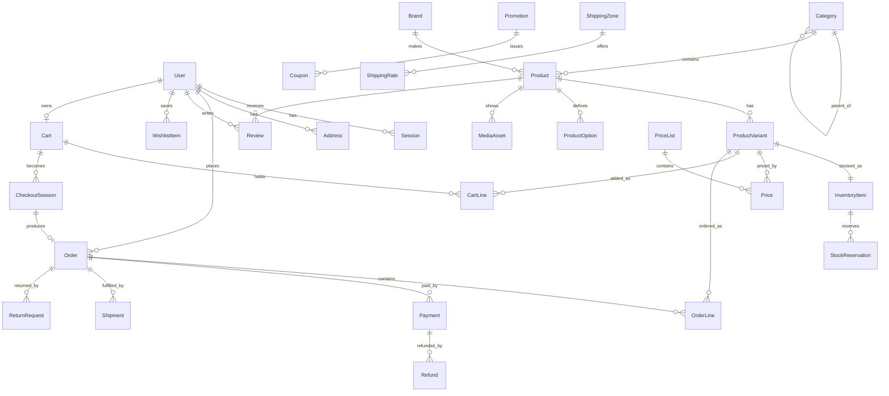
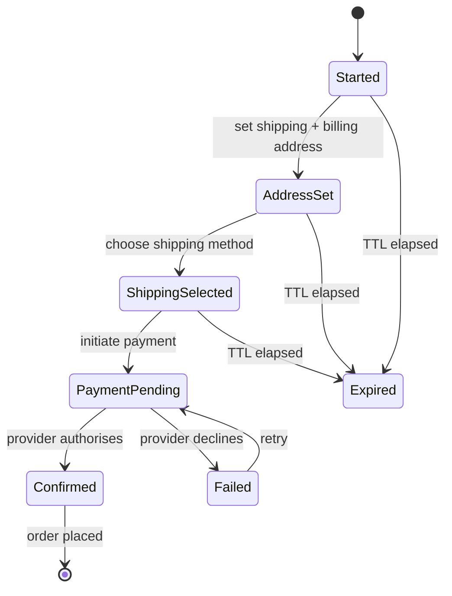
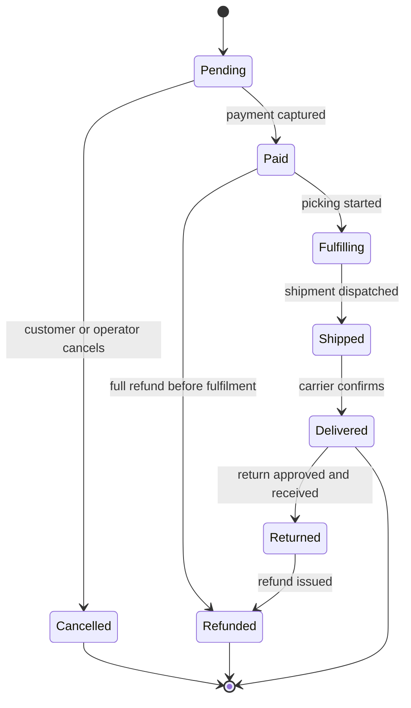

# Agentic Ecommerce — Specification

This file is the **source of truth**. GitHub issues are generated from §7; the `pr-reviewer`
subagent checks pull requests against the acceptance criteria here, not against whatever was built.
When reality outgrows this document, amend the document in the same PR.

---

## 1 · Purpose

A modern ecommerce platform — storefront, admin, API — built as a monorepo. Every line of it is
produced by Claude Code through an automated loop: GitHub issue → branch → implement → verify → pull
request → subagent review → auto-merge on green.

The workflow is as much the deliverable as the product. See `.claude/rules/00-workflow.md`.

---

## 2 · Invariants

Non-negotiable rules. A PR that breaks one fails review regardless of whether tests pass.

| #   | Invariant                                                                                                                                                             | Enforced by                                         |
| --- | --------------------------------------------------------------------------------------------------------------------------------------------------------------------- | --------------------------------------------------- |
| I1  | **Money is an integer in minor units**, always paired with an ISO-4217 currency. No floats, no `toFixed` for money.                                                   | `no-restricted-properties` lint rule + review       |
| I2  | **Contracts live in `@repo/contracts`.** Every API request/response shape is a Zod schema there; apps import inferred types. No hand-written API DTO inside `apps/*`. | `guard-write.mjs` hook + `contract-auditor`         |
| I3  | **Every error response is RFC 9457 Problem Details.** One global exception filter, no ad-hoc error shapes.                                                            | Integration tests + review                          |
| I4  | **Another user's resource returns 404, never 403.** Existence is not leaked.                                                                                          | `security-auditor` + per-module cross-account tests |
| I5  | **Every mutating endpoint is authorised explicitly.** No route relies on "nothing links here".                                                                        | `security-auditor`                                  |
| I6  | **Money-moving and order-creating endpoints are idempotent** via `Idempotency-Key`; webhooks are idempotent by provider event id.                                     | Integration tests                                   |
| I7  | **Migrations are additive and replayable.** `db:reset && db:migrate && db:seed` must succeed from empty at every commit on `main`.                                    | CI                                                  |
| I8  | **The seed is idempotent.** Running it twice changes nothing the second time.                                                                                         | CI                                                  |
| I9  | **No `.skip` / `.only` on `main`.** A test that cannot fail is worse than no test.                                                                                    | CI grep + `pr-reviewer`                             |
| I10 | **No direct commits to `main`.** Every change arrives by reviewed PR.                                                                                                 | `guard-git.mjs` hook + branch protection            |

---

## 3 · Stack

Versions verified against the registry on 2026-08-12 and pinned deliberately.

| Layer               | Choice                                                      | Version | Note                                                                               |
| ------------------- | ----------------------------------------------------------- | ------- | ---------------------------------------------------------------------------------- |
| Package manager     | pnpm                                                        | 10.18.0 | Corepack 0.34 on this machine cannot run pnpm 11 — see ADR-0006                    |
| Build orchestration | Turborepo                                                   | 2.10.9  |                                                                                    |
| Language            | TypeScript                                                  | 5.9.3   | **Not 7.x** — `typescript-eslint` caps at `<6.1.0` and `ts-jest` at `<7`. ADR-0007 |
| API                 | NestJS                                                      | 11.1.29 | Modular monolith                                                                   |
| ORM                 | Prisma                                                      | 7.9.1   | Requires Node ^20.19 — satisfied by 20.20.0                                        |
| Database            | PostgreSQL                                                  | 17      | FTS + `pg_trgm` for search; no separate search engine                              |
| Cache / queue       | Redis 7 + BullMQ                                            |         | Jobs: email, image processing, reservation expiry                                  |
| Frontends           | Next.js                                                     | 16.3.0  | App Router, RSC, ISR                                                               |
| UI                  | React 19.2.8 + Tailwind + shadcn/ui                         |         |                                                                                    |
| Validation          | Zod                                                         | 4.4.3   | Single source of contract truth                                                    |
| Linting             | ESLint 9.39.5 + typescript-eslint 8.67.0                    |         | Flat config. **Not ESLint 10** — `eslint-plugin-jsx-a11y` 6.10.2 peers cap at `^9` |
| Testing             | Jest + Supertest (API), Vitest (packages), Playwright (E2E) |         |                                                                                    |
| Mail (dev)          | Mailpit                                                     |         | MailHog's maintained successor                                                     |
| Object storage      | MinIO                                                       |         | S3-compatible                                                                      |

### Ports

Offset from defaults because 5432, 5433 and 4200 are already occupied on the development machine.

| Service             | Port        |
| ------------------- | ----------- |
| Storefront          | 3000        |
| API                 | 3001        |
| Admin               | 3002        |
| PostgreSQL          | 5442        |
| Redis               | 6389        |
| Mailpit SMTP / UI   | 1026 / 8026 |
| MinIO API / console | 9010 / 9011 |

### Environment variables the API reads

Every variable is declared in the Zod schema at `apps/api/src/config/env.ts` and nowhere else.

| Variable             | Default (non-production) | Notes                                                                                                                                   |
| -------------------- | ------------------------ | --------------------------------------------------------------------------------------------------------------------------------------- |
| `NODE_ENV`           | `development`            | Absent or unrecognised means internal error detail is **suppressed**                                                                    |
| `API_PORT`           | `3001`                   |                                                                                                                                         |
| `API_PREFIX`         | `api/v1`                 |                                                                                                                                         |
| `DATABASE_URL`       | compose stack            | **Required explicitly** when `NODE_ENV=production`                                                                                      |
| `REDIS_URL`          | compose stack            | **Required explicitly** when `NODE_ENV=production`                                                                                      |
| `LOG_LEVEL`          | unset                    | Un-silences structured logs under `NODE_ENV=test`                                                                                       |
| `JWT_ACCESS_SECRET`  | committed dev value      | HS256 key for the access token. ≥32 chars. **Required explicitly** in production, and the committed development value is rejected there |
| `JWT_REFRESH_SECRET` | committed dev value      | HMAC key for refresh-token hashes. Same rules. Rotating it invalidates every refresh token                                              |
| `DOCS_ENABLED`       | unset                    | Serves `/api/docs*`. Unset follows `NODE_ENV` and **fails closed** — absent or unrecognised means no document (#66)                     |

---

## 4 · Repository layout

```
apps/
  api/          NestJS — modular monolith
  storefront/   Next.js — customer-facing
  admin/        Next.js — operator-facing
packages/
  contracts/    Zod schemas + inferred types + generated enums   ← I2
  ui/           shared React design system
  config/       eslint · tsconfig · prettier bases
infra/          docker-compose + local service config
e2e/            Playwright, cross-app journeys
docs/           architecture.md + adr/
.claude/        the agentic harness
```

### API module map

```
apps/api/src/
  infra/      prisma · redis · bullmq · mailer · storage · telemetry
  common/     guards · interceptors · filters · decorators · pagination
  modules/    auth users catalog inventory pricing cart checkout
              payments orders shipping reviews search admin
```

---

## 5 · Domain model



### Entity notes

- **Product / ProductVariant** — the variant is the sellable unit. Price, SKU, stock and weight hang
  off the variant, never the product.
- **InventoryItem** carries `onHand`, `reserved` and a `version` column for optimistic concurrency.
  Available stock is `onHand - reserved`, computed, never stored.
- **StockReservation** is created at checkout start with a TTL, committed at order placement,
  released by a BullMQ job on expiry. This is what stops overselling.
- **Price** is `{ amountMinor: Int, currency: String, priceListId }` — see I1.
- **CheckoutSession** is a state machine (§6.2) distinct from `Cart`; the cart stays mutable, the
  session freezes what is being bought. A cart may produce **several** sessions over time — a
  session that expires or fails is replaced by a new one rather than resurrected — but at most one
  is active. _(Amended in F3: the original ERD showed at most one session per cart.)_
- **AuditLog** records every admin mutation: actor, action, entity, before/after, timestamp.

---

## 6 · Cross-cutting design

### 6.1 · Errors — RFC 9457

Every non-2xx response:

```jsonc
{
  "type": "https://agentic-shop.dev/errors/insufficient-stock",
  "title": "Insufficient stock",
  "status": 409,
  "detail": "Only 2 units of SKU TSHIRT-BLK-M remain.",
  "instance": "/api/v1/cart/lines",
  "traceId": "01JB2X...",
  "errors": [{ "path": "lines.0.quantity", "message": "exceeds available stock" }],
}
```

`errors[]` appears only for validation failures. `traceId` is on every response and correlates to
structured logs.

### 6.2 · Checkout state machine



Illegal transitions return `409` with a Problem Details body. Expiry releases stock reservations.

### 6.3 · Order state machine



Transitions are executed only through an `OrderStateMachine` service that rejects illegal moves; no
code sets `order.status` directly.

### 6.4 · Auth

Access JWT (15 min, stateless) + refresh token (30 d, rotating, stored hashed and revocable).
Refresh reuse detection: presenting an already-rotated refresh token revokes the whole session
family. Roles: `CUSTOMER`, `SUPPORT`, `ADMIN`.

_Detail settled in F8:_

- The access token is HS256 with claims `{ sub, sid, iss, aud, iat, exp }` — `sid` is the session
  that minted it, so F9 can revoke a token's lineage. No `role` claim until the Prisma enum is
  generated into `@repo/contracts` (F10).
- The refresh token is **opaque** (256 bits of CSPRNG output), not a JWT, and what is stored is
  `HMAC-SHA256(JWT_REFRESH_SECRET, token)` — keyed, so a database dump alone cannot confirm a
  guessed token; deterministic, so the row is found by its unique index. Argon2id is deliberately
  not used here: the input is high-entropy, and a salted hash could not be looked up at all.
- Rotation is a conditional `UPDATE … WHERE rotated_at IS NULL` inside a transaction. The loser of a
  race is treated as reuse, and **there is no grace window** — two simultaneous refreshes cost the
  family, which is the price of the rule in §60-security ("evidence of theft, not a retry"). Clients
  serialise their refreshes.
- The refresh cookie is `httpOnly; secure; sameSite=strict`, scoped to `/<API_PREFIX>/auth`.
- `Session.rotatedAt` was added in F8 (migration `session_rotation_tracking`): it is both the
  used-flag that makes rotation atomic and the evidence that makes reuse detectable, so rotated rows
  are kept rather than deleted.

### 6.5 · Pagination

Cursor-based on every list endpoint:
`{ items: T[], pageInfo: { nextCursor: string | null, hasNextPage: boolean } }`. Offset pagination
is allowed only in admin tables that genuinely need page numbers.

### 6.6 · Payments

```
interface PaymentProvider {
  createIntent(input): Promise<PaymentIntent>
  capture(intentId, idempotencyKey): Promise<PaymentResult>
  refund(paymentId, amountMinor, idempotencyKey): Promise<RefundResult>
  verifyWebhook(rawBody, signature): WebhookEvent
}
```

`MockPaymentProvider` is the default in dev, CI and tests: deterministic, with magic amounts that
force decline / timeout / partial-refund paths so failure branches are genuinely covered.
`StripePaymentProvider` implements the same port and activates on `PAYMENT_PROVIDER=stripe`.

---

## 7 · Features

Each `F*` becomes one GitHub issue and one PR. `AC` bullets are what the reviewer verifies.
Dependencies are hard ordering constraints.

### E0 · Foundation

**F1 · Monorepo toolchain** — _deps: none_

- AC1 `pnpm install` succeeds from clean clone on Node 20.19+.
- AC2 `pnpm verify` runs format, lint, typecheck, test, build and exits 0.
- AC3 `packages/config` exports eslint, prettier and tsconfig bases consumed by every package.
- AC4 Turbo caches build and typecheck; a second `pnpm build` is a full cache hit.

**F2 · Local infrastructure** — _deps: F1_

- AC1 `pnpm infra:up` starts Postgres, Redis, Mailpit and MinIO with healthchecks passing.
- AC2 All ports match §3 and none collide with an already-running service.
- AC3 `pnpm infra:reset` removes volumes and the stack comes back clean.
- AC4 `.env.example` documents every variable the stack reads.

**F3 · Prisma foundation** — _deps: F2_

- AC1 Schema covers the §5 entities with correct relations, indexes and enums.
- AC2 Initial migration applies to an empty database.
- AC3 `pnpm db:reset && pnpm db:seed` succeeds twice in a row with identical resulting state (I7,
  I8).
- AC4 Seed produces a browsable catalogue: ≥3 categories, ≥2 brands, ≥20 products with variants,
  stock and prices, plus one admin and one customer account. _(Amended in F8: the two accounts now
  carry real Argon2id hashes of the development password exported as `SEED_ACCOUNT_PASSWORD`, so
  they can actually sign in through `POST /auth/login`. Hashed only on creation, so a second seed
  run still writes nothing — I8 holds.)_
- AC5 Money columns are `Int` minor units + currency (I1).

**F4 · API bootstrap** — _deps: F3_

- AC1 Nest boots on `API_PORT` with global prefix `api/v1`.
- AC2 Env is validated by a Zod schema at startup; a missing required var fails fast with a message
  naming the variable.
- AC3 `GET /health` returns 200 always; `GET /health/ready` returns 200 only when Postgres and Redis
  both answer, and 503 with a Problem Details body when either does not.
- AC4 OpenAPI served at `/api/docs`. _(Amended in F8, closing #66: served only where
  `DOCS_ENABLED`/`NODE_ENV` says so. The default fails closed — an unconfigured or production
  deployment serves 404 on `/api/docs`, `/api/docs-json` and `/api/docs-yaml`, because once
  authenticated routes exist the document is a machine-readable index of the attack surface.)_

**F5 · Error handling & logging** — _deps: F4_

- AC1 Global exception filter renders every error as RFC 9457 (I3), including Zod validation
  failures mapped to `errors[]`.
- AC2 Unhandled exceptions return 500 without leaking stack traces or SQL in production mode.
- AC3 Every request gets a `traceId`, returned in the body and the `X-Trace-Id` header, present in
  every log line for that request.
- AC4 Structured JSON logs with request method, path, status, duration and `traceId`.

**F6 · CI pipeline** — _deps: F1_

- AC1 On every PR: install, format:check, lint, typecheck, test, build.
- AC2 Integration tests run against a real Postgres service container.
- AC3 A migration-replay job proves `db:reset` from empty (I7).
- AC4 A guard job fails the build on `.only` or `.skip` in test files (I9).
- AC5 Turbo cache is restored between runs; the pipeline is under 10 minutes.

### E1 · Identity & accounts

**F7 · Registration** — _deps: F5_

- AC1 `POST /auth/register` creates a user with an Argon2id-hashed password.
- AC2 Password policy enforced (min 12 chars, not in a common-password list); violations return 422
  with per-field `errors[]`.
- AC3 Duplicate email returns 409 and does **not** reveal whether the address exists via timing or
  message differences elsewhere in the flow.
- AC4 Email is normalised and stored case-insensitively unique.

**F8 · Login & tokens** — _deps: F7_

- AC1 `POST /auth/login` returns an access JWT and sets a refresh token in an httpOnly, secure,
  sameSite=strict cookie.
- AC2 `POST /auth/refresh` rotates the refresh token and invalidates the previous one.
- AC3 Presenting a rotated (reused) refresh token revokes the entire session family and returns 401.
- AC4 Wrong credentials return 401 with a generic message, in constant time relative to a valid one.
- AC5 Access tokens expire in 15 minutes; expired tokens return 401, not 500.

_Note on AC5:_ F8 ships the `JwtAuthGuard` that turns a bearer token into verified claims, but does
NOT register it globally — "a route with no decorator is denied by default" is F10/AC3 and needs
`@Roles()` in the same change. F8 therefore has no protected production route to point AC5 at (`/me`
is F12, `/auth/sessions` is F9), so the end-to-end 401-not-500 test mounts the real guard on a probe
controller declared inside `jwt-auth.guard.e2e-spec.ts`. Everything under test — guard, token
service, Problem Details filter, wiring — is production code; only the route is synthetic.

**F9 · Sessions** — _deps: F8_

- AC1 `GET /auth/sessions` lists the caller's active sessions with device, IP and last-used.
- AC2 `DELETE /auth/sessions/:id` revokes one; revoking another user's session returns 404 (I4).
- AC3 `POST /auth/logout` revokes the current session and clears the cookie.
- AC4 A revoked session's refresh token cannot be used.
- AC5 `JwtAuthGuard` is registered globally, so a route with no authorisation decorator is denied by
  default — a test asserts the default is closed, not open (I5). _Moved here from F10/AC3: F9 adds
  the first non-public routes, and without the guard the I5 sweep would have been satisfied by
  marking a session list `@Public()`._

**F10 · RBAC** — _deps: F8_

- AC1 `@Roles()` decorator + guard covering `CUSTOMER`, `SUPPORT`, `ADMIN`.
- AC2 Every admin route rejects a customer token with 403.
- AC3 _Moved to F9/AC5._ Default-closed landed with F9, which needed it; F10 narrows the
  authenticated default to specific roles rather than establishing it.

**F11 · Email verification & password reset** — _deps: F7, F39_

- AC1 Registration queues a verification email; the token is single-use and expires in 24 h.
- AC2 Unverified accounts can browse but cannot check out.
- AC3 Password reset issues a single-use token expiring in 1 h; using it revokes all sessions.
- AC4 Reset request for an unknown email returns 202 identically to a known one.

**F12 · Profile & addresses** — _deps: F8_

- AC1 `GET`/`PATCH /me` for profile.
- AC2 Full CRUD on `/me/addresses` with one default shipping and one default billing address.
- AC3 Reading or mutating another user's address returns 404 on every verb (I4).

### E2 · Catalog

**F13 · Categories** — _deps: F5_

- AC1 Self-referencing tree with slug, sort order and depth limit.
- AC2 `GET /categories` returns the tree in one query — no N+1.
- AC3 A cycle is rejected at write time with 422.

**F14 · Brands** — _deps: F5_ — AC1 CRUD with unique slug · AC2 listing with product counts.

**F15 · Products & variants** — _deps: F13, F14_

- AC1 Product with options (e.g. size, colour) generating variants with unique SKUs.
- AC2 `GET /products/:slug` returns product, options, variants, prices, media and stock availability
  in a bounded number of queries — a query-count test asserts it.
- AC3 Publishing state (`DRAFT`/`PUBLISHED`/`ARCHIVED`); unpublished products are invisible to
  storefront endpoints and return 404.
- AC4 Duplicate SKU rejected with 409.

**F16 · Media** — _deps: F15_

- AC1 Presigned upload to MinIO; only image mime types accepted.
- AC2 A BullMQ job derives thumbnail, card and hero renditions.
- AC3 Every asset requires alt text — enforced at the API, not just the UI (a11y).
- AC4 Ordering, and exactly one primary image per product.

**F17 · Inventory** — _deps: F15_

- AC1 `InventoryItem` per variant with `onHand`, `reserved`, `version`.
- AC2 Reservation decrements availability atomically; a concurrency test fires N parallel
  reservations against 1 unit of stock and asserts exactly one wins.
- AC3 Reservations expire via a scheduled job and return stock.
- AC4 Overselling is impossible even under the parallel test in AC2.

**F18 · Storefront PDP** — _deps: F15, F16_

- AC1 Server-rendered product page with variant selector, gallery, price and stock state.
- AC2 ISR with on-demand revalidation when the product changes.
- AC3 Out-of-stock and unpublished states render correctly rather than erroring.
- AC4 Lighthouse a11y ≥ 95; keyboard-navigable variant selection.

**F19 · Storefront PLP** — _deps: F18_

- AC1 Category listing with pagination, sort and skeleton loading states.
- AC2 Filters (price range, brand, in-stock) reflected in the URL and shareable.
- AC3 Empty and error states designed, not blank.

### E3 · Search & browse

**F20 · Full-text search** — _deps: F15_

- AC1 `pg_trgm` + `tsvector` index over product name, description, brand, SKU.
- AC2 `GET /search?q=` ranks by relevance and tolerates a one-character typo.
- AC3 Only published products are returned.
- AC4 A search across the seeded catalogue completes in < 200 ms warm.

**F21 · Faceted filtering** — _deps: F20_

- AC1 Facet counts for brand, category, price bucket and availability, consistent with the applied
  filter set.
- AC2 Combined facets + query + pagination stay correct together.

**F22 · Autocomplete** — _deps: F20_

- AC1 `GET /search/suggest` returns product, category and brand suggestions under 50 ms warm.
- AC2 Debounced storefront UI, fully keyboard-navigable with correct ARIA combobox semantics.

**F23 · SEO** — _deps: F18, F19_

- AC1 Per-page title/description/canonical/OpenGraph metadata.
- AC2 `Product` and `BreadcrumbList` JSON-LD validating against schema.org.
- AC3 `sitemap.xml` and `robots.txt` generated from published products.

### E4 · Cart

**F24 · Guest cart** — _deps: F15, F17_

- AC1 Cart created on first add, keyed by a signed httpOnly cookie.
- AC2 Adding beyond available stock returns 409 with the available quantity in `detail`.
- AC3 Carts expire after 30 days via a scheduled job.

**F25 · User cart & merge** — _deps: F24, F8_

- AC1 Logging in merges the guest cart into the user cart, summing quantities and re-validating
  stock.
- AC2 Merge is idempotent — logging in twice does not double quantities.
- AC3 Another user's cart is never readable (I4).

**F26 · Cart operations** — _deps: F24_

- AC1 Add, update quantity, remove, clear — each re-validating price and stock.
- AC2 A variant that became unpublished is flagged in the response and blocked at checkout.
- AC3 Optimistic UI with rollback on failure.

**F27 · Totals engine** — _deps: F26, F40_

- AC1 Deterministic pipeline: line subtotal → discounts → shipping → tax → grand total, all in
  integer minor units (I1).
- AC2 Rounding is applied once, at a defined stage, and unit-tested against a table of known cases.
- AC3 Totals are identical between cart, checkout and the placed order — an integration test asserts
  the three agree.

### E5 · Checkout & payments

**F28 · Checkout session** — _deps: F27_

- AC1 State machine per §6.2; illegal transitions return 409.
- AC2 Session snapshots prices at creation; later price changes do not alter an in-flight checkout.
- AC3 TTL expiry releases stock reservations.

**F29 · Shipping** — _deps: F28_

- AC1 Zones and rates (flat, weight-banded, free-over-threshold).
- AC2 Only methods valid for the destination are offered.
- AC3 Selecting a method updates totals immediately.

**F30 · Payment port + mock** — _deps: F28_

- AC1 `PaymentProvider` interface per §6.6 with `MockPaymentProvider` as default.
- AC2 Magic amounts deterministically trigger decline, timeout and partial-refund paths, and tests
  cover each.
- AC3 No Stripe key is needed for any test or for local checkout to work end to end.

**F31 · Stripe adapter** — _deps: F30_

- AC1 `StripePaymentProvider` implements the same port; provider chosen by `PAYMENT_PROVIDER`.
- AC2 Webhook signature verified against the raw body; an invalid signature returns 400.
- AC3 Webhook handling is idempotent by event id — replaying an event changes nothing (I6).
- AC4 With no keys configured, the app still boots and the mock stays active.

**F32 · Idempotency** — _deps: F30_

- AC1 `Idempotency-Key` honoured on order placement, payment capture and refund.
- AC2 Replaying a key returns the original response without repeating the side effect.
- AC3 The same key with a different request body returns 422.
- AC4 A concurrency test fires duplicate requests in parallel and asserts exactly one side effect.

**F33 · Order placement** — _deps: F32, F17_

- AC1 Placement is one transaction: commit reservations, create order and lines, record payment,
  clear cart.
- AC2 Payment failure rolls everything back and leaves no partial order.
- AC3 Placement is idempotent under duplicate submits (I6).
- AC4 A concurrency test on the last unit of stock produces exactly one order.

### E6 · Orders & fulfilment

**F34 · Order state machine** — _deps: F33_

- AC1 Transitions per §6.3, executed only through the state-machine service.
- AC2 Illegal transitions return 409 and are unit-tested exhaustively.
- AC3 Every transition writes an audit entry.

**F35 · Order history** — _deps: F34_

- AC1 Paginated list and detail for the signed-in customer.
- AC2 Another user's order returns 404 on every verb (I4).
- AC3 Detail loads in a bounded query count — asserted by test.

**F36 · Shipments** — _deps: F34_

- AC1 Full and partial shipments with carrier and tracking number.
- AC2 Shipping all lines moves the order to `Shipped`; partial does not.
- AC3 Dispatch queues a shipping-confirmation email.

**F37 · Cancellation** — _deps: F34_

- AC1 Customers may cancel while `Pending` or `Paid`; not after `Fulfilling`.
- AC2 Cancellation releases stock and triggers a refund when payment was captured.

**F38 · Returns & refunds** — _deps: F36_

- AC1 Return request per line with reason and quantity, within a configurable window.
- AC2 Operator approval, receipt, then refund through the payment port.
- AC3 Partial refunds are supported and never exceed the captured amount — asserted by test.
- AC4 Refunds restock returned items.

**F39 · Transactional email** — _deps: F4_

- AC1 BullMQ queue + worker; templates for verification, reset, order confirmation, shipping,
  refund.
- AC2 Failures retry with backoff and land in a dead-letter queue after N attempts.
- AC3 Delivery is asserted in tests against Mailpit's API.
- AC4 Every email renders in plain text as well as HTML.

### E7 · Merchandising

**F40 · Promotions & coupons** — _deps: F27_

- AC1 Percentage, fixed-amount and free-shipping promotions with validity windows.
- AC2 Coupon codes with usage limits — global and per-customer — enforced under parallel redemption.
- AC3 Stacking rules are explicit and unit-tested against a table of combinations.
- AC4 An invalid or expired code returns 422 with a reason, and never silently applies.

**F41 · Reviews** — _deps: F15, F34_

- AC1 Only customers who bought the product may review it — verified against delivered orders.
- AC2 Moderation states `PENDING`/`APPROVED`/`REJECTED`; only approved reviews are public.
- AC3 Aggregate rating is maintained without an N+1 on the PDP.
- AC4 One review per customer per product.

**F42 · Wishlist** — _deps: F8, F15_ — AC1 add/remove/list · AC2 move to cart · AC3 scoped to owner
(I4).

**F43 · Related & recently viewed** — _deps: F18_

- AC1 Related products by shared category and brand, excluding the current and unpublished products.
- AC2 Recently viewed persisted per session without blocking render.

**F44 · Price lists** — _deps: F15_

- AC1 Multiple price lists with priority resolution to exactly one effective price per variant.
- AC2 Resolution order is deterministic and unit-tested.

### E8 · Admin

**F45 · Admin shell** — _deps: F10_

- AC1 Admin app behind `ADMIN` role; a customer token cannot reach any admin route.
- AC2 Layout with navigation, breadcrumbs and a global error boundary.
- AC3 Session expiry redirects to login without losing the intended destination.

**F46 · Catalog management** — _deps: F45, F15_

- AC1 CRUD for products, variants, categories, brands and media with Zod-validated forms.
- AC2 Publish / unpublish reflected on the storefront within one revalidation cycle.
- AC3 Every mutation writes an `AuditLog` entry.

**F47 · Order management** — _deps: F45, F34_

- AC1 Search and filter orders by status, customer, date and total.
- AC2 Operators can transition state, ship, cancel and refund within the state machine's rules.
- AC3 Full order timeline from the audit log.

**F48 · Customer management** — _deps: F45_

- AC1 Search customers; view orders, addresses and sessions.
- AC2 Support role is read-only; a test asserts it cannot mutate.
- AC3 No password hash or token value is ever exposed in an admin response.

**F49 · Dashboard** — _deps: F47_

- AC1 Revenue, order count, AOV and top products over a selectable range.
- AC2 Queries are indexed and complete in < 500 ms on the seeded dataset.
- AC3 Charts are accessible — data also available as a table.

### E9 · Hardening

**F50 · Observability** — _deps: F5_

- AC1 OpenTelemetry traces across HTTP, Prisma and BullMQ.
- AC2 `traceId` correlates logs, traces and API responses.
- AC3 `/metrics` exposes request rate, latency histogram and error rate.

**F51 · Rate limiting & security headers** — _deps: F8_

- AC1 Per-IP and per-account limits on auth, checkout and search; 429 carries `Retry-After`.
- AC2 CSP, HSTS, `X-Content-Type-Options`, `Referrer-Policy` set on both frontends.
- AC3 CORS is an explicit allowlist, never `*` with credentials.
- AC4 `pnpm audit` has no high or critical findings.

**F52 · Performance** — _deps: F49_

- AC1 An N+1 audit across every list and detail endpoint, with query-count tests locking the results
  in.
- AC2 Redis caching for catalogue reads with explicit invalidation on write.
- AC3 Storefront Lighthouse performance ≥ 90 on PDP and PLP.

**F53 · Accessibility** — _deps: F19, F23_

- AC1 Automated axe pass with zero violations on home, PLP, PDP, cart and checkout.
- AC2 Full keyboard operability of the buy journey, with visible focus throughout.
- AC3 Correct landmarks, heading order and form labelling.

**F54 · E2E & load** — _deps: F33, F53_

- AC1 Playwright covers browse → search → add to cart → checkout → order confirmation, as guest and
  as signed-in customer.
- AC2 Admin journey: create product → publish → appears on storefront.
- AC3 The suite runs in CI against a seeded database and is not flaky over 3 consecutive runs.
- AC4 A load smoke establishes a documented baseline for the checkout path.

---

## 8 · Epics

| Epic | Milestone           | Features | Depends on |
| ---- | ------------------- | -------- | ---------- |
| E0   | Foundation          | F1–F6    | —          |
| E1   | Identity & accounts | F7–F12   | E0         |
| E2   | Catalog             | F13–F19  | E0         |
| E3   | Search & browse     | F20–F23  | E2         |
| E4   | Cart                | F24–F27  | E2, E1     |
| E5   | Checkout & payments | F28–F33  | E4         |
| E6   | Orders & fulfilment | F34–F39  | E5         |
| E7   | Merchandising       | F40–F44  | E4, E6     |
| E8   | Admin               | F45–F49  | E6         |
| E9   | Hardening           | F50–F54  | E8         |

**54 features → 54 issues → 54 pull requests.**

---

## 9 · Definition of Done

A feature is done when **all** hold:

1. Every `AC` is implemented and covered by a test that would fail if the behaviour regressed.
2. `pnpm verify` is green locally and in CI.
3. Contracts for new payloads live in `@repo/contracts` (I2).
4. New env vars appear in `.env.example`, the Zod env schema, `infra/docker-compose.yml` where
   relevant, and §3 of this file.
5. Schema changes ship with a migration, an updated seed, and `db:reset` replays clean (I7, I8).
6. Cross-account access is tested on every verb of every new owned resource (I4).
7. OpenAPI regenerated if routes changed.
8. `pr-reviewer` returns `PASS`.
9. This file is amended where reality diverged from it.

---

## 10 · Progress

Updated by the loop as each feature merges.

| Epic             | Done  | Total  |
| ---------------- | ----- | ------ |
| E0 Foundation    | 6     | 6      |
| E1 Identity      | 3     | 6      |
| E2 Catalog       | 0     | 7      |
| E3 Search        | 0     | 4      |
| E4 Cart          | 0     | 4      |
| E5 Checkout      | 0     | 6      |
| E6 Orders        | 0     | 6      |
| E7 Merchandising | 0     | 5      |
| E8 Admin         | 0     | 5      |
| E9 Hardening     | 0     | 5      |
| **Total**        | **9** | **54** |
