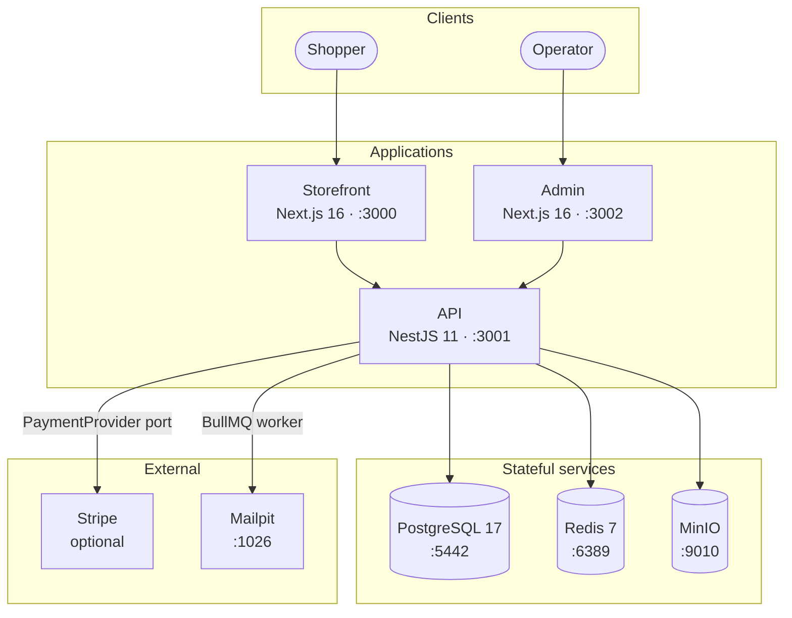
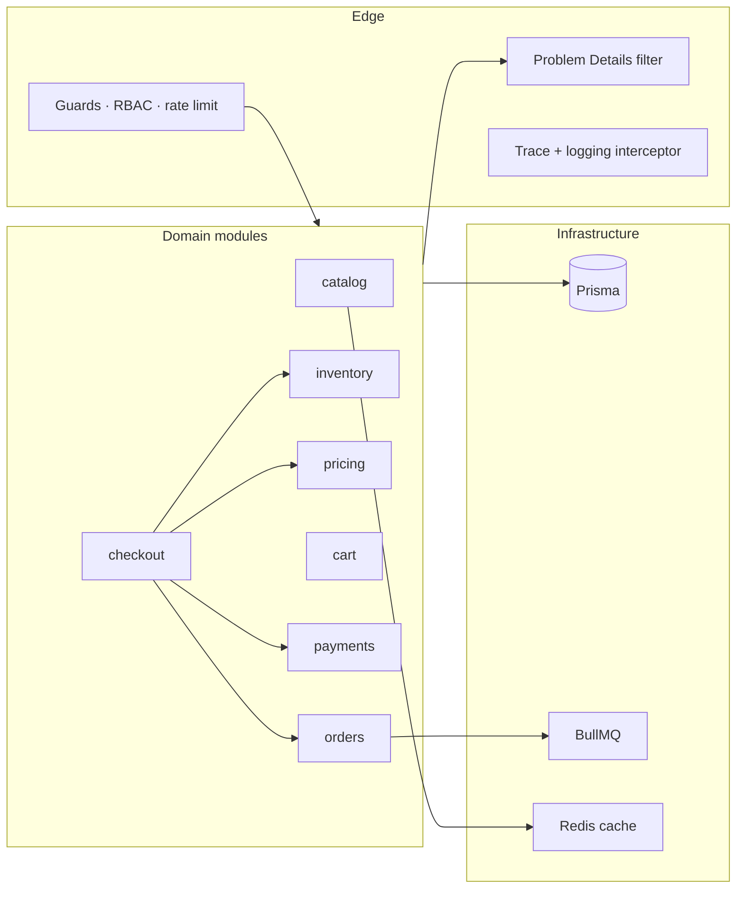
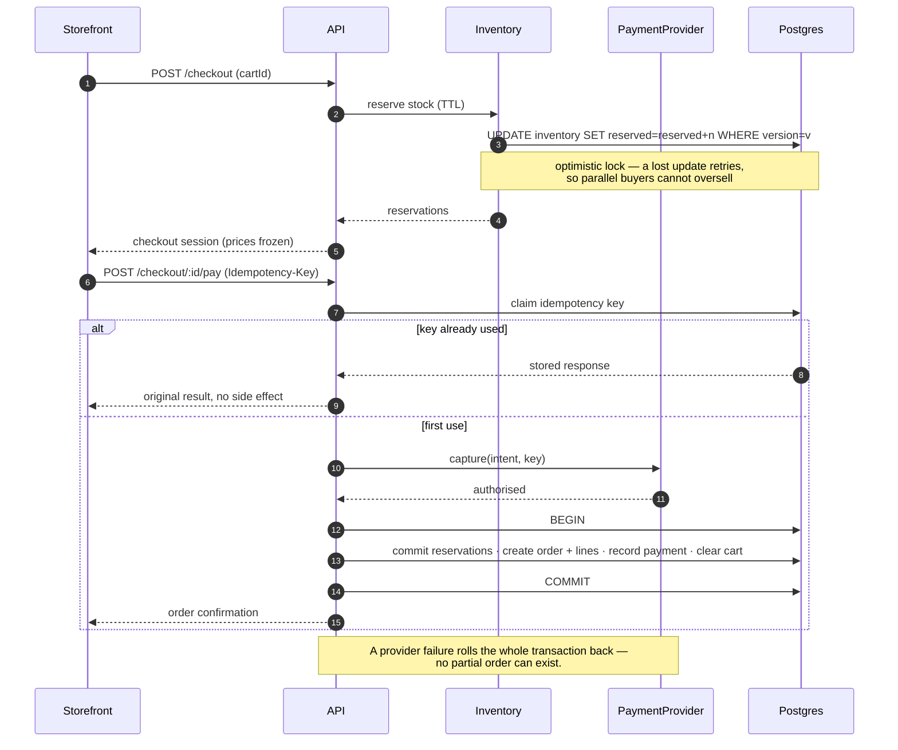
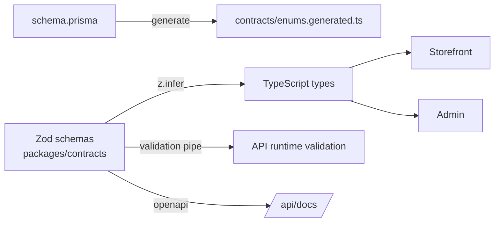
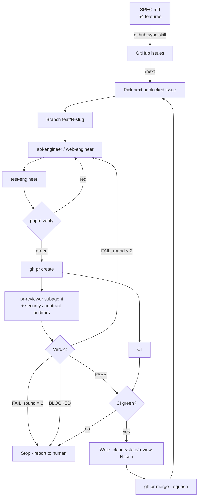

# Architecture

Companion to [SPEC.md](../SPEC.md). The spec defines _what_ is built and the acceptance criteria;
this file explains _how the system is put together_ and _how the build pipeline itself works_.

---

## 1 · System context

The storefront and admin never talk to Postgres. All data access goes through the API, which keeps
authorisation in exactly one place.

---

## 2 · Why a modular monolith

The API is one deployable with hard internal module boundaries — not microservices. See
[ADR-0001](adr/0001-modular-monolith.md).

The boundaries are real: a module may only be reached through its exported service, never by
importing another module's repository or reaching into its Prisma models directly. That keeps the
option of extracting a service later without paying for distributed transactions now — which matters
most at checkout, where stock reservation, payment capture and order creation must commit together.

---

## 3 · The checkout path

The highest-risk flow in the system, and the reason for the transaction boundary in §2.

Two independent protections against double-charging and overselling:

1. **Idempotency keys** — a replayed request returns the stored response instead of acting again.
2. **Optimistic concurrency on inventory** — a `version` column means two parallel reservations for
   the last unit cannot both succeed.

Both are proven by tests that fire genuinely parallel requests, not sequential loops. A sequential
test would pass even with the race present, which is exactly the kind of fake coverage the
`pr-reviewer` subagent is told to hunt for.

---

## 4 · Contracts as the single source of truth

One schema produces runtime validation, static types for both frontends, and the OpenAPI document. A
frontend cannot drift from the API, because there is no second place to declare the shape.

`guard-write.mjs` blocks the drift at the source: an attempt to declare an API payload interface
inside `apps/*` is rejected before the file is written.

---

## 5 · The agentic build pipeline

The workflow that produces the code above.

### Why the gate is a hook, not an approval

GitHub refuses to let an author approve their own pull request, so with a single identity there is
no way to produce a real "Approved" check. Rather than simulate one, the gate is enforced where it
cannot be bypassed: `guard-git.mjs` runs before every Bash call and **blocks `gh pr merge` unless a
`PASS` verdict for the current head SHA exists on disk**.

This is stronger than an approval button. An approval is advisory — a human or agent can merge
anyway. The hook makes merging without a recorded review _impossible_, and it holds even if the
orchestrating agent misreads its own instructions mid-run. See
[ADR-0008](adr/0008-hook-enforced-merge-gate.md).

Branch protection covers the other half: `main` requires a PR and green status checks. Required
approvals are deliberately **not** enabled, because with one identity they would deadlock every PR.

---

## 6 · Environments

|                | Local                         | CI                                 |
| -------------- | ----------------------------- | ---------------------------------- |
| Postgres       | Docker, port 5442             | service container                  |
| Redis          | Docker, port 6389             | service container                  |
| Mail           | Mailpit, asserted via its API | Mailpit service container          |
| Object storage | MinIO                         | MinIO service container            |
| Payments       | `MockPaymentProvider`         | `MockPaymentProvider` — always     |
| Migrations     | `pnpm db:migrate`             | replayed from empty every run (I7) |

CI never needs a secret to run the full suite. That is a deliberate property: it means a PR from any
context can be verified, and it is why payments sit behind a port with a deterministic mock.
